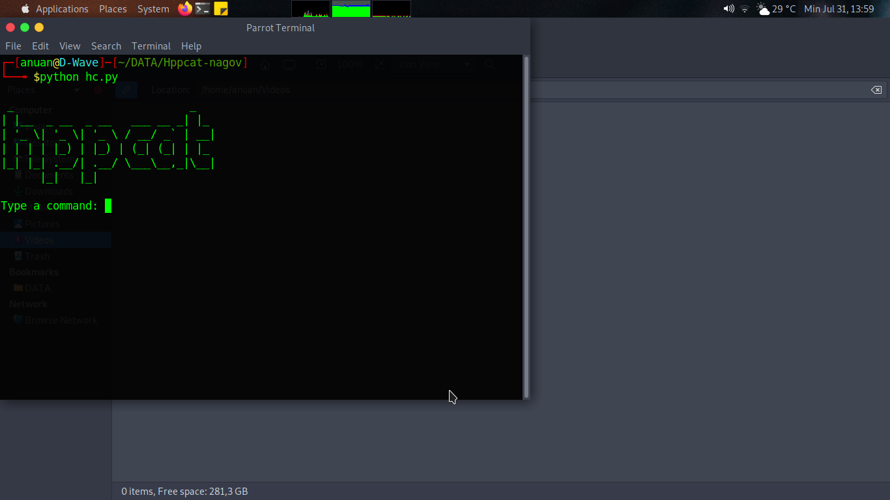

# hppcat
A file hidener for linux build with python

What is Hppcat?
hppcat is file hidener for linux that hide your files on the computer with no one know. 
Not really hide your files but send it to systemfiles and archiving it. 
Useful to hide sprivate items that yout want your friends know

## usage

to use,follow the steps below

$ chmod +x install.sh

then

$ ./install.sh

if install was completed, run the file hpc

$ python hpc.py

### License
this program is under GNU GPL license
